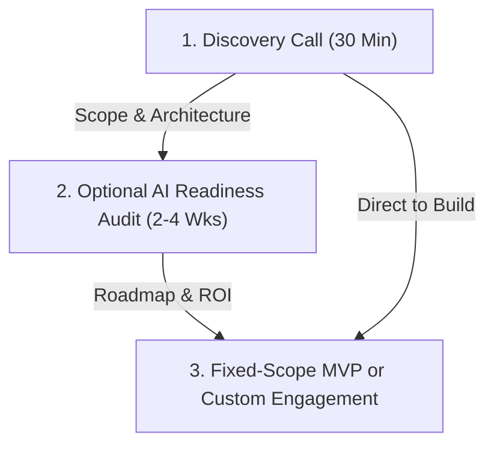

# 🌊 riverborn

### We build AI systems that actually ship.

**Production-grade AI agents, voice systems, and creative AI infrastructure — built by a team that runs its own AI
products at scale.**

---

  
  
  
  

**riverborn** is an AI System Development company. Based in Bangladesh with global delivery, we partner with CTOs, VPs
of Engineering, and Heads of AI at Series A–C startups, mid-market, and enterprise teams to design, architect, and
deploy robust, production-grade AI systems.

---

## ⚡ Why riverborn?

> [!NOTE] **Operational, not aspirational.** The same engineering architecture we deliver to our clients powers our own
> consumer AI products. We don't just build demos; we run high-traffic production systems serving 100K+ users every day.

- **Dual-Market Track Record:** We operate 10+ live consumer products (e.g., Vocalo AI, PhotoFox AI). Because we are our
  own first customer, the pipelines, agents, and systems we build for you are already battle-tested under real-world
  traffic.
- **Founder-Led Architecture:** CEO Nasim Uddin personally leads the engineering design on every single engagement. You
  collaborate directly with the architects of your system, ensuring zero middleman friction.
- **Structural Cost Advantage:** World-class engineering talent based in Bangladesh. We deliver identical production
  quality to top-tier US/EU agencies at a **40–60% structural cost advantage**.
- **Engineered to Run:** Observability, error budgets, and performance targets are defined before we ship, ensuring your
  system is production-ready, not just pitch-ready.

---

## 📂 Our Shipped Portfolio

We prove our capabilities in the consumer market before standardizing them into enterprise systems. Two markets, one
core engine:

| Consumer Product                         | Enterprise System | Key Industry Focus            | Core Capability                                          |
| :--------------------------------------- | :---------------- | :---------------------------- | :------------------------------------------------------- |
| **PhotoFox AI** _photofoxai.com_      | **Chitron AI**    | E-commerce, Retail, D2C       | Batch creative generation with brand consistency         |
| **Vocalo AI** _vocalo.ai_             | **Dhoni AI**      | BPO, Call Centers, HR         | Live agent assist, real-time analytics & CRM integration |
| **QuizMaker AI** _quizmakerai.org_    | **Jachai AI**     | HR, Training, Compliance      | Automated assessment generation from policy docs         |
| **SketchToImage** _sketchtoimage.com_ | **Rupon AI**      | Architecture, Real Estate     | concept-to-client-ready design visualization             |
| **AiStoryGen** _aistorygen.org_       | **Rachona AI**    | Marketing, EdTech, Publishing | Brand-aligned multi-format content pipelines             |
| **InvoiceAgent** _invoiceagent.ai_    | **Nothi AI**      | Finance, Legal, Operations    | Documents parsed into structured LLM-ready data          |

---

## 🛠️ What You Can Build With Us

We construct custom infrastructure tailored to your exact operational requirements:

- **Autonomous AI Agents:** Systems that plan, execute multi-step work, self-correct, and maintain persistent state.
- **Knowledge-Aware Conversational AI:** RAG-native chatbots unified seamlessly across text and voice channels.
- **Telephony-Integrated Voice AI:** Integrated voice agents with real-time speech intelligence, transcription, and CRM
  sync.
- **Private AI Cloud & On-Premise:** Self-hosted models and pipelines built for strict compliance and zero external API
  dependencies.
- **System-of-Record Integration:** Wiring models directly into your CRM, ERP, and HRIS pipelines via clean APIs.

---

## 🤝 How We Work

We offer transparent, predictable models designed to align with how modern engineering teams build:

### Fixed-Scope Packages

- **AI Readiness Audit (2–4 weeks):** Feasibility score, prioritized use cases, and technical roadmap before you build.
- **30-Day AI Agent MVP (4 weeks):** Delivery of a production-ready AI agent with guaranteed fixed scope and zero
  surprise charges.
- **AI Integration Sprint (4–6 weeks):** Integrating models and pipelines into your existing systems.
- **AI Workflow Automation Audit (2–3 weeks):** Bottleneck mapping and ROI projections.

---

## 👥 Meet the Founders

- **Nasim Uddin (Founder & CEO):** Leads technical architecture. Shipped AI infrastructure across voice, agents, and
  generative systems for 5+ years.
- **Nasir Uddin (Co-Founder & COO):** Oversees operations, delivery models, and system compliance.
- **Raihan Ahmed (Co-Founder & CMO):** Shapes brand narrative, market positioning, and matches production solutions to
  enterprise needs.

---

## 📬 Connect with Us

Ready to transition from demo to deployment?

- Visit our website: [riverborn.com](https://riverborn.com)
- Reach out directly: [hello@riverborn.ai](mailto:hello@riverborn.ai)
- [Book a 30-minute discovery call](https://riverborn.com#contact) to map your architecture.
